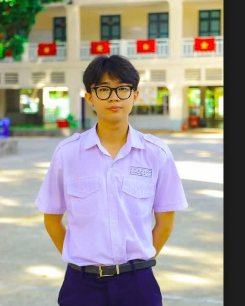

# Portfolio for JYU Immersive Software Engineering and AI

## About Me
Lâm Đường Phong - Builder passionate about AI and robotics. IELTS 7.5, SAT 1230 (Math 640). Strengths: Problem-solving, team leadership.

## Software engineering skills (major)
- **Programming Languages**: Python, JavaScript, C++ , TypeScript, Java
- **Frontend**:ReactJS,TailwindCSS
- **Backend**:NodeJS,ExpressJS,API design
- **Cloud&DevOps**: AWS S3, AWS EC2, Docker ,Kubernetes ,CI/CD pipelines
- **AI/ML**: PyTorch, Keras, TensorFlow,YOLO, OpenCV; model fine‑tuning; evaluation metrics; deployment for inference.
- **Database**: MongoDB, SQL , Firebase
- **Technique** : Advanced prompt engineering ;Agent AI engineering ; RESTful API; Data structure
- **Tools**: Git flow, Cloudinary, Trello ,Asana, Figma
- **Concepts**: Algorithmic Thinking, Discrete Math, AI Debugging

## Robotics engineering skills (minor/hobby)
- **Stacks & integration**: ROS/ROS2 (packages, nodes, topics, launch files), MoveIt (basic motion planning)
- **Simulation for validation**: Webots, CoppeliaSim, Gazebo (scenario setup, sensor models, KPIs)
- **Embedded bridge**:ESP32, Raspberry Pi,Arduino (firmware integration, UART/SPI/I2C, CAN)
- **Control & planning (practical scope)**: PID tuning, trajectory tracking, forward/inverse kinematics for common platforms
- **Perception & SLAM (applied):** : OpenCV + YOLO inference, sensor fusion basics, visual/LiDAR SLAM at prototype level
- **Realtime & protocols**: Latency budgeting, MQTT/TCP/UDP, message timing, logging/telemetry

## Projects
1. **Genius Olympiad Robotics**
- Description: Led team to build autonomous robot for environmental challenge. Solved pathfinding in real-time.
- Tech: Arduino, Python (ROS), ML for object detection.
- Role: Leader - Handled tech conflicts using STAR method.
- [Repo Link](link) | [Demo Video](video.mp4)

2. **Tin Học Trẻ Competition**
- Description: Developed algorithm for optimization problem (e.g., shortest path).
- Tech: Pseudocode to Python implementation.
- [Code Snippet](snippet.py)

... (Thêm dự án mới)

## Contact
phonglam@example.com | [LinkedIn](link)
